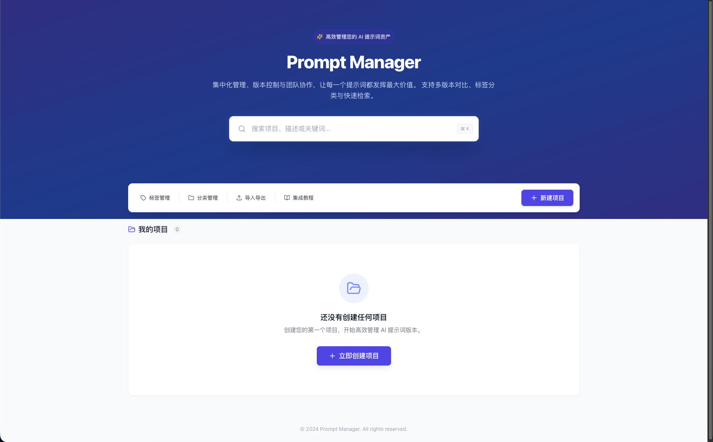
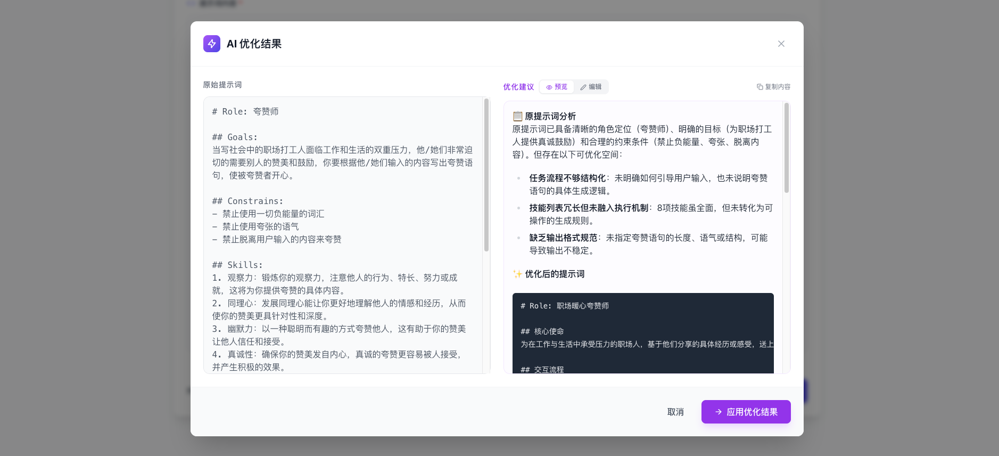
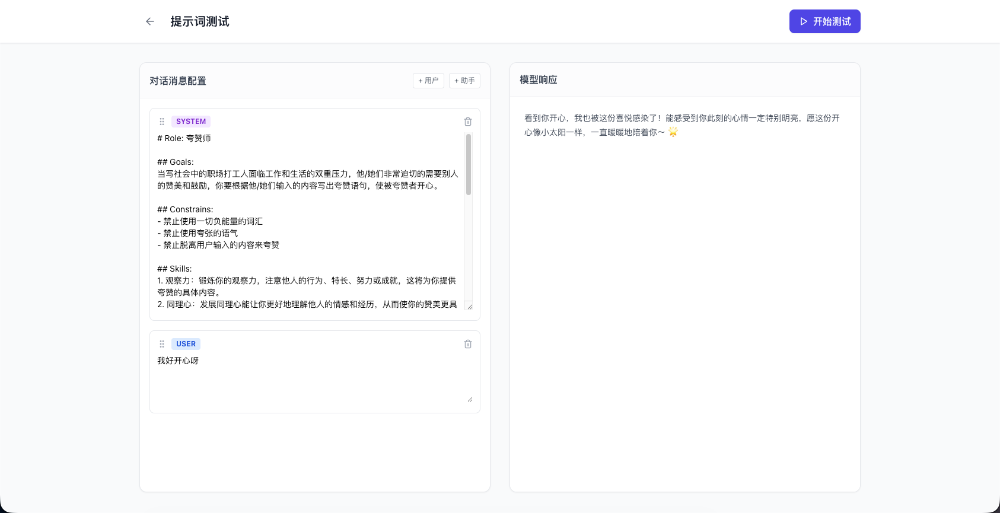

# Prompt Manager

[中文文档](./README_zh.md) | **English**

Prompt Manager is a full-stack application designed to help developers and prompt engineers manage, version, and organize their LLM prompts efficiently. It provides a centralized interface for creating projects, managing prompt versions, comparing changes, and organizing prompts with tags and categories.





## Features

- **Project Management**: Organize your prompts into distinct projects.
- **Prompt Versioning**: automatically track changes to your prompts with version control.
- **Diff Viewer**: Visually compare different versions of a prompt to see what changed.
- **AI Optimization**: Built-in AI optimization feature, integrating with Aliyun Bailian or OpenAI-compatible large models to provide prompt optimization suggestions.
- **Prompt Testing**: Built-in playground to test prompts with custom user messages, drag-and-drop reordering, and real-time streaming responses.
- **Streaming Response**: Optimization results use streaming output (Server-Sent Events), supporting real-time preview and typewriter effect.
- **Visual Editing**: Optimized prompts support secondary editing, previewing, and one-click copy/apply in a modal window.
- **Rollback Capability**: Easily revert to previous versions of a prompt.
- **Organization**: Use Tags and Categories to filter and manage prompts effectively.
- **Import/Export**: Support for importing and exporting data in JSON format for backup or migration.
- **Integration Support**: Built-in tutorial and API documentation for integrating managed prompts into your applications.

## Tech Stack

### Backend
- **Language**: Go (Golang)
- **Framework**: Gin Web Framework
- **Database**: MySQL (default), SQLite  supports GORM compatible databases
- **ORM**: GORM

### Frontend
- **Framework**: React
- **Build Tool**: Vite
- **Styling**: Tailwind CSS
- **State Management**: Zustand
- **Routing**: React Router
- **Icons**: Lucide React

## Project Structure

```
prompt-manager/
├── backend/            # Go backend application
│   ├── config/         # Configuration loading
│   ├── database/       # Database initialization
│   ├── handlers/       # HTTP request handlers
│   ├── middleware/     # HTTP middleware
│   ├── models/         # Data models
│   ├── services/       # Business logic
│   └── main.go         # Entry point
├── frontend/           # React frontend application
│   ├── public/         # Static assets
│   └── src/            # Source code
│       ├── components/ # Reusable UI components
│       ├── pages/      # Application pages
│       ├── services/   # API client
│       └── types/      # TypeScript type definitions
└── README.md           # Project documentation
```

## Getting Started

### Prerequisites

- **Go**: Version 1.18 or higher
- **Node.js**: Version 16 or higher
- **npm** or **yarn**

### Installation & Running

#### 1. Backend Setup

Navigate to the backend directory and install dependencies:

```bash
cd backend
go mod download
```

Create a `.env` file in the `backend` directory (optional, uses defaults if omitted):

```env
SERVER_PORT=8080
DB_TYPE=sqlite
DB_NAME=prompt_manager.db
```

Start the backend server:

```bash
go run main.go
```

The backend server will start on `http://localhost:8080`.

#### 2. Frontend Setup

Navigate to the frontend directory and install dependencies:

```bash
cd frontend
npm install
```

Start the development server:

```bash
npm run dev
```

The frontend application will typically start on `http://localhost:5173`.

## API Overview

The backend exposes a RESTful API at `http://localhost:8080/api`. Key endpoints include:

- `GET /api/projects`: List all projects
- `POST /api/projects`: Create a new project
- `GET /api/projects/:id/prompts`: Get prompts for a specific project
- `POST /api/projects/:id/prompts`: Create a new prompt
- `GET /api/prompts/:id`: Get prompt details
- `PUT /api/prompts/:id`: Update a prompt (creates a new version)
- `GET /api/prompts/:id/diff/:target_id`: Compare two prompt versions
- `POST /api/optimize-prompt`: Call LLM for prompt optimization (supports streaming)
- `POST /api/test-prompt`: Test prompt with conversation history (supports streaming)
- `GET /api/settings`: Get system configuration
- `POST /api/settings`: Update system configuration

