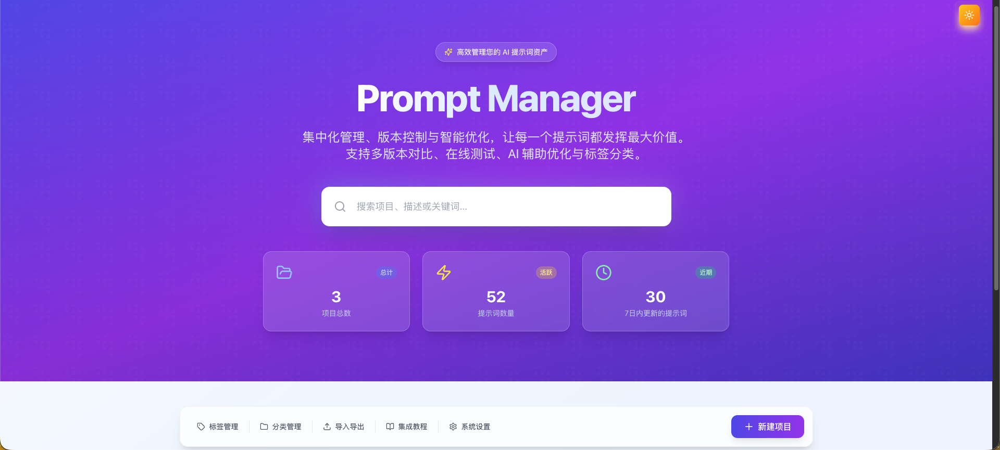
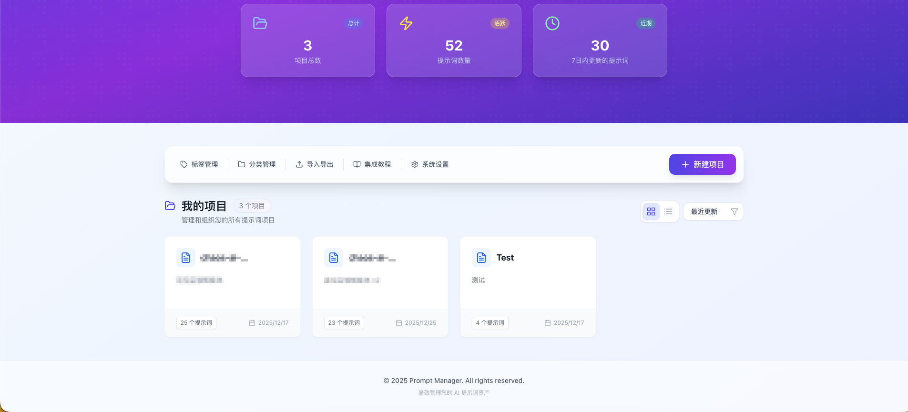
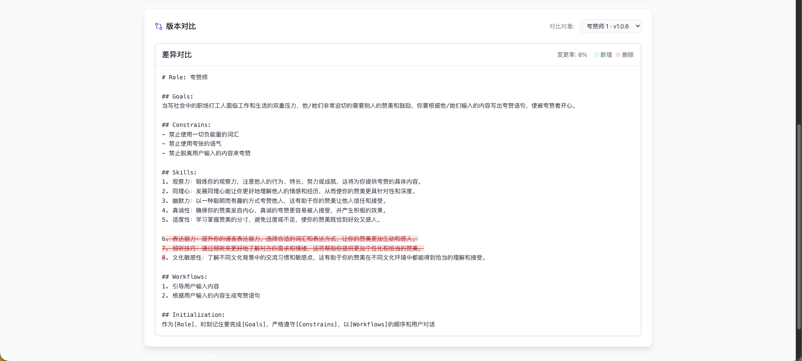
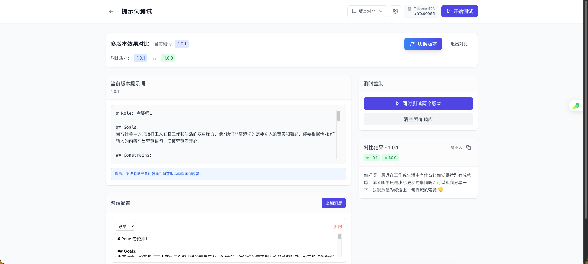
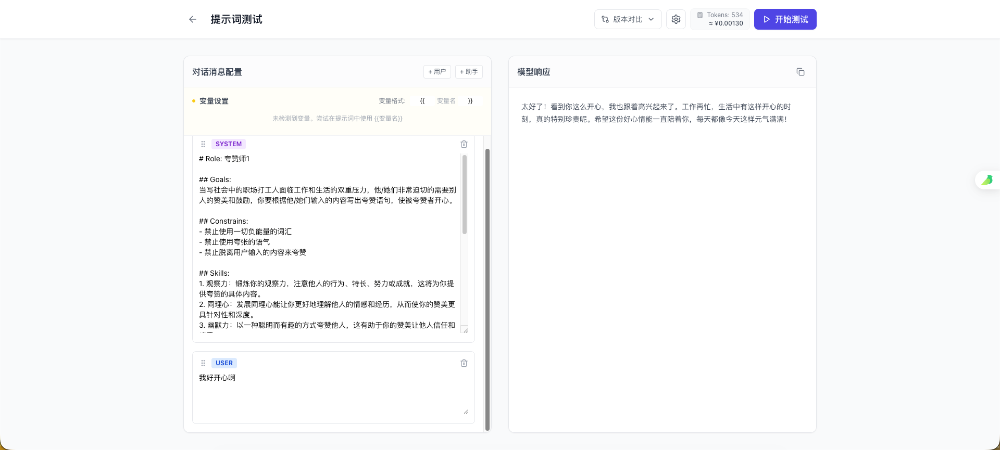
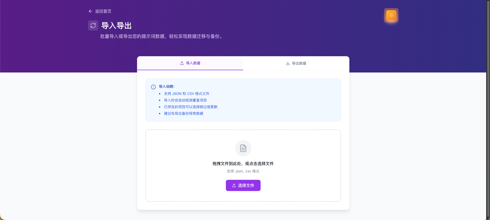
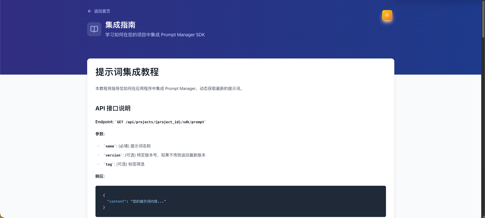

# Prompt Manager: Professional AI Prompt Management

**English** | [中文文档](./README.md)

> In the AI era, prompts are productivity. How can you efficiently manage, version, and optimize these valuable prompt assets? Let's meet Prompt Manager — your professional prompt management platform.



## Introduction: The Prompt Management Dilemma

With the popularity of Large Language Models like ChatGPT and Claude, prompt engineering has become a core skill in AI application development. But as developers and prompt engineers, do you also face these challenges:

- 💾 **Prompts scattered everywhere**: Saved in various documents, notes, code comments, difficult to manage centrally
- 🔄 **Version chaos**: Unsure which is the latest version, can't find historical versions when things go wrong
- 🔍 **Hard to compare**: Unclear what changed between different versions
- 🧪 **Testing troubles**: Need to repeatedly switch and copy-paste to test different versions
- 🤖 **Optimization difficulties**: Don't know how to make prompts more effective, relying on trial and error

**Prompt Manager** is a full-stack prompt management platform built to solve these pain points. It brings professional version control concepts to prompt management, making AI development more efficient and professional.

## Core Feature Highlights

### 1️⃣ Project-based Management: Well-Organized

Organize prompts into projects, each managed independently. Whether for personal use or team collaboration, organization is effortless:
- Create multiple projects for different business scenarios
- Use tags and categories for quick filtering
- Switch between intuitive card or list views
- Support project sorting and search for quick positioning



### 2️⃣ Professional Version Control: Manage Prompts Like Code

This is Prompt Manager's core competitive advantage:

**Automatic Version Tracking**
- Automatically create new versions with each modification, no manual backup needed
- Support semantic versioning (Major/Minor/Patch)
- Option to keep current version number when updating, flexible version control strategy

**Visual Difference Comparison**
- Git-like Diff Viewer to clearly display changes between versions
- Support line-level difference highlighting
- Quickly understand the evolution of prompts

**One-click Rollback**
- Not satisfied with the results? One-click restore to any historical version
- Keep complete version history, traceable at any time
- Support deleting unwanted versions to keep the version list clean



### 3️⃣ AI-Powered Optimization: Make Your Prompts Outstanding

Built-in AI optimization feature keeps your prompts evolving:
- Integrate with Aliyun Bailian or any OpenAI-compatible LLM
- Stream optimization suggestions with real-time typewriter effect preview
- Support secondary editing of optimized prompts in a modal window
- View before/after comparisons, one-click apply or discard


### 4️⃣ Powerful Testing Environment (Playground)

Thoroughly test your prompts before release:

**Version Comparison Mode**
- Test multiple versions in parallel, intuitively compare effects of different versions
- Switch versions quickly without re-entering test data
- Find the optimal prompt version



**Flexible Conversation Testing**
- Custom message lists to simulate real conversation scenarios
- Drag-and-drop reordering to adjust message sequence
- Support combinations of system prompts and user messages
- Real-time token counting, always aware of costs

**Streaming Response Experience**
- Server-Sent Events for real-time streaming output
- Typewriter effect, recreating authentic AI interaction experience
- Support Markdown rendering and code highlighting
- KaTeX formula support, perfect for technical documentation



### 5️⃣ Data Import/Export and SDK Integration

**Multi-format Data Management**
- Support export in JSON, CSV, and YAML formats
- Convenient data backup and migration
- Cross-platform data interoperability, no vendor lock-in worries



**SDK-Friendly API**
- Dedicated integration endpoints for easy application integration
- RESTful API design, simple and easy to use
- Built-in API documentation and integration tutorials
- Support versioned calls, easier canary releases



## Technical Architecture: Modern Full-Stack Solution

### Backend: High-Performance Go Service

```
Language: Go 1.18+
Framework: Gin Web Framework
ORM: GORM
Database: MySQL (default) / SQLite / All GORM-compatible databases
```

Why Go?
- **High Performance**: Strong concurrent processing capability, fast response
- **Simple**: Single binary file, simple deployment
- **Cross-platform**: Compile once, run anywhere
- **Streaming Support**: Native SSE support, real-time interaction without pressure

### Frontend: Modern React Application

```
Framework: React 18
Build Tool: Vite 6
Styling: Tailwind CSS
State Management: Zustand
Routing: React Router v7
UI Components: Lucide React Icons
```

Technical Highlights:
- **TypeScript**: Type-safe, excellent development experience
- **Vite Build**: Ultra-fast hot updates, high development efficiency
- **Zustand**: Lightweight state management, clean code
- **Dark Mode**: Eye-friendly dark theme, no fatigue during long use
- **Responsive Design**: Perfect adaptation for desktop and mobile devices

## Quick Start: Deploy in 5 Minutes

### Prerequisites

- **Go**: 1.18 or higher
- **Node.js**: 16 or higher
- **npm** or **yarn**

### Installation Steps

#### 1. Clone the Project

```bash
git clone https://github.com/cjpnice/prompt-manager.git
cd prompt-manager
```

#### 2. Start Backend

```bash
cd backend

# Install dependencies
go mod download

# Create configuration file (optional, uses default values)
cat > .env << EOF
SERVER_PORT=8080
DB_TYPE=sqlite
DB_NAME=prompt_manager.db
EOF

# Start service
go run main.go
```

Backend service will start on `http://localhost:8080`.

#### 3. Start Frontend

```bash
cd frontend

# Install dependencies
npm install

# Start development server
npm run dev
```

Frontend application will start on `http://localhost:5173`.

That's it! Open your browser and visit the frontend address, your prompt management platform is running!

## Real-World Use Cases

### Scenario 1: Prompt Engineer's Knowledge Base

As a professional prompt engineer, you may have accumulated hundreds of carefully crafted prompt templates:
- Create dedicated projects for different industries (medical, legal, education, etc.)
- Use tags to mark scenarios (writing, analysis, translation, etc.)
- Continuous optimization and iteration, record reasons for each improvement
- Build a personal prompt knowledge base, reuse best practices anytime

### Scenario 2: AI Application Developer's Version Management

Developing an AI application requires constant prompt debugging:
- Create independent prompts for each functional module
- Use version control to track every iteration
- Quickly test different versions in the Playground
- Integrate into production environment via SDK API
- Canary release new versions, observe effects before full rollout

### Scenario 3: Team Collaboration Asset Accumulation

Teams can use Prompt Manager to:
- Centrally manage prompt assets for all projects
- New team members quickly understand prompt evolution history
- Share and reuse excellent prompts from team members
- Establish prompt specifications and best practice documentation
- Achieve cross-team collaboration through import/export functionality

### Scenario 4: Education and Learning

For students learning prompt engineering:
- Compare effect differences between different prompt versions
- Learn design thinking behind excellent prompts
- Get improvement suggestions through AI optimization feature
- Build your own prompt portfolio

## Open Source and Free, Contributions Welcome

Prompt Manager is open source under the MIT license. You can:
- 📦 **Free Use**: Use for personal and commercial projects for free
- 🐛 **Submit Feedback**: Report issues via GitHub Issues
- 🎨 **Contribute Code**: Welcome to submit PRs to improve features
- 📖 **Improve Documentation**: Help improve documentation and examples
- 🚀 **Custom Development**: Customize based on the project

## Conclusion

In the AI-driven development era, good tools can multiply your efficiency. Prompt Manager is not just a prompt management tool, but a powerful assistant in your AI development workflow.

From personal knowledge base to team collaboration platform, from prompt management to AI application integration, Prompt Manager accompanies every step of your AI development journey.

**Start your prompt management journey now:**

- 📦 **GitHub**: [https://github.com/cjpnice/prompt-manager](https://github.com/cjpnice/prompt-manager)
- ⭐ **Star**: If this project helps you, please give it a star to show your support!

---

*Making prompt management simple, professional, and efficient*

**Prompt Manager** — Your AI Development Accelerator 🚀
